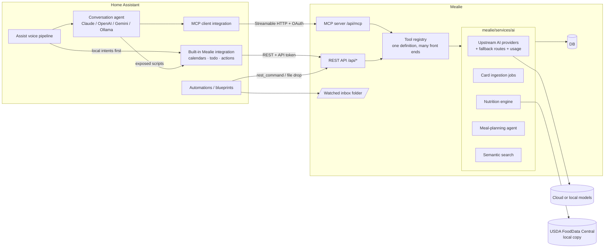

# AI Integration Plan

_Branch `ai-integration`, based on upstream Mealie `v3.28.0`. The earlier scanning work is on
`add-ocr-recipe`. Drafted 2026-10-02._

This plan picks up the recipe-card scanning work from `add-ocr-recipe` and turns it into a broader AI layer for this
fork. Mealie stays the system of record for recipes, nutrition and meal plans. Home Assistant (HA) becomes the voice
and automation front door.

> **Read first: this branch syncs the fork with upstream.**
> The fork's `mealie-next` and `add-ocr-recipe` are on upstream `v3.1.2` (Aug 2025). This branch is rebuilt on
> **`v3.28.0` (2026-09-24)**, 1,551 commits newer, which already has much of what `add-ocr-recipe` was reaching for
> (§2.2). This matters for Home Assistant: **HA 2026.10 raises the built-in Mealie integration's minimum to v3.2.0**,
> so a v3.1.2 deployment stops working with HA after that update. Phase 0 finishes the sync by porting only what
> upstream still lacks.

---

## 1. Goals

| # | Story | Example |
|---|-------|---------|
| G1 | **Voice queries over recipes** through HA Assist | "What's for dinner?", "Find a chicken recipe under 30 minutes", "What's step 3?", "Add tonight's ingredients to the shopping list" |
| G2 | **Ingest recipe cards** (handwritten or printed, one card or a whole box) as structured recipes, keeping the original card image | Phone photo, batch upload, or a file dropped into a watched folder |
| G3 | **Nutrition goals** per household member, set in the UI, by voice, or by an HA automation | "Set my daily protein goal to 140 grams" |
| G4 | **Guided meal planning**: an agent works over *your* recipe collection to propose a week that fits the goals, explains the trade-offs, takes feedback, then writes the plan and the shopping list | "Plan dinners for next week, two vegetarian nights, nothing over 45 minutes on weeknights" |

Not in scope for now: medical-grade nutrition advice, logging what was actually eaten, and price or budget data.

---

## 2. Where things stand

### 2.1 `add-ocr-recipe`

21 commits (2025-08-28 → 2025-09-01) on top of `v3.1.2`.

- **What works:** Gemini vision scanning end to end. A primary → secondary → Tesseract fallback chain. An admin page
  at `/admin/recipe-scanning` backed by a DB settings singleton. A standalone Tesseract endpoint and page. A dev Docker
  image with Tesseract and HEIC support, plus an Unraid template.
- **What's broken:**
  - The OpenAI path calls `openai_service.chat_completion_with_images(...)`, which doesn't exist
    (`image_scanning_service.py:161`). Choosing OpenAI as primary therefore always falls through to the next provider.
  - Anthropic and Ollama are `NotImplementedError` stubs.
  - "Test connection" is mocked and always succeeds.
  - API keys are stored in plaintext; the encrypt helper is a no-op.
  - `AdminSettings.get_instance()` re-applies env vars and commits on every read, so values saved in the UI get
    overwritten.
  - The Gemini path uses `google-generativeai`, which **reached end of support on 2025-11-30**.
  - The `/api/app/about` field `enableOpenaiImageServices` was renamed.
  - Leftover `DEBUG` logs dump recipe contents.
  - The OCR test is permanently skipped.
- **Clutter at the repo root:** `IMG_2503.jpg` (3.6 MB), `quick_test.py`, `demo_image_scanning.py`,
  `ocr_test_result.json`, `static/test_ocr.html(.bak)`, the root `package.json`/`package-lock.json`, and
  `docker/Dockerfile.fixed`/`.test`.

### 2.2 What upstream shipped since (v3.2 → v3.28)

| Upstream now has | Since | Effect on this plan |
|---|---|---|
| **AI providers stored in the DB, per group, managed in the UI.** Each has `base_url`, `api_key`, `model`, headers and params. Groups map them to **task slots `default` / `audio` / `image`**. The `OPENAI_*` env vars are imported once by a migration. Tables: `ai_providers`, `ai_provider_settings` | v3.19 | **Supersedes the branch's `admin_settings` table and `/admin/recipe-scanning` page.** Note that upstream already uses the name `ai_provider_settings`. |
| Structured outputs (`chat.completions.parse` with Pydantic schemas) and customizable prompts | v3.10 | Supersedes the branch's hand-written JSON prompts and the code that strips Markdown fences |
| **`POST /api/recipes/create/ai`** (+ `/stream` with SSE progress) taking any mix of text, URL and **images**, run as a multi-step `RecipeImportWorkflow` that resolves organizers (tags, categories). `/create/image` is deprecated | v3.23 | This is the new base for card ingestion. `AIRecipeService.build_recipe()` returns an **unsaved** recipe, which is exactly what a review queue needs. |
| Image resizing before AI import; `pillow-heif` dependency | v3.25 | Supersedes the branch's HEIC work |
| Provider connectivity test (including whether the model accepts images) | v3.27 | Supersedes the mocked test |
| Video import (YouTube, TikTok, …) through the audio slot | v3.13 | Free win |
| Meal-plan types `snack`, `drink`, `dessert`; meal-plan re-roll | v3.7, v3.23 | The planner can use snacks natively |
| Nutrition shown with units; unit conversion | v3.13, v3.28 | Nutrition values are still free-text strings. **No calculation exists** |

**What upstream still doesn't have**, and therefore what this fork adds:

- a provider fallback chain
- any wire protocol other than the OpenAI-compatible one
- a review queue for imports, batch ingestion, or a watched folder
- OCR without a model (Tesseract)
- nutrition calculation and goals
- AI meal planning
- an MCP server or any Assist/voice tooling

The last is still an open upstream discussion, `mealie-recipes/mealie` discussion #7051.

### 2.3 Branch pieces: port, drop or replace

| `add-ocr-recipe` piece | Action |
|---|---|
| `ImageScanningService` fallback chain | **Port the idea**: an ordered fallback list per upstream task slot (§4.1) |
| Gemini via `google-generativeai` | **Drop.** Use Gemini's OpenAI-compatible endpoint as an upstream provider record (no SDK needed) |
| Tesseract service and `/create/image/ocr` | **Port** as the last step of the fallback chain, behind an optional extra (decision D3) |
| `admin_settings` table, `/admin/recipe-scanning` page, `about` field rename | **Drop** in favor of upstream's AI Providers UI |
| `CreateRecipe` field fix | **Drop**; upstream's workflow already handles it |
| `docker/Dockerfile.dev`, `docker-compose.dev-ocr.yml`, `my-mealie-dev.xml` (Unraid) | **Port and refresh** for the new base |
| `IMG_2503.jpg` | **Move** to `tests/data/cards/` as the first eval fixture |
| Everything else in the clutter list | **Drop** |

---

## 3. Target architecture



Principles:

1. **Extend upstream's AI layer; don't replace it.** Upstream's `OpenAIService`, provider records and
   `RecipeImportWorkflow` are the foundation. New code lives in new modules (`services/ai/`, `routes/ai/`,
   `routes/mcp/`).
2. **Deterministic where it matters.** LLMs extract, match, rank and explain. Arithmetic (nutrition totals,
   plan scoring) is plain Python the agent calls as a tool.
3. **Drafts before writes.** AI output lands as a reviewable draft (an ingestion job or a meal-plan draft) and becomes
   real data only when a person commits it. This is also the main prompt-injection defence (§7).
4. **Local-first is possible, never required.** Every feature works with a local model served by Ollama.
5. **One tool registry.** Tools are defined once and exposed over MCP, a REST tool endpoint, and the web planner.

---

## 4. Workstreams

### 4.1 AI platform additions (on top of upstream)

Upstream gives one provider per slot (`default`, `audio`, `image`) over the OpenAI-compatible protocol. This fork
adds the following.

- **More slots:** `planner` (tool use, reasoning), `fast` (cheap structured calls such as food matching and tagging),
  and `embedding`. Each falls back to `default` when unset.
- **Fallback routes:** a side table `ai_provider_routes(settings_id, slot, priority, provider_id)`, so a slot can be
  `[Gemini, local Ollama, Tesseract]`. It's a side table rather than new columns on upstream tables, to keep upstream
  migrations conflict-free.
- **Protocol adapters:** most vendors work through the OpenAI-compatible protocol, including Gemini's
  `/v1beta/openai/` endpoint, Ollama, OpenRouter and vLLM. Anthropic's OpenAI-compatible endpoint has documented
  limitations, so for Claude add an `ai_provider_ext(provider_id, protocol, capabilities)` side row with
  `protocol = anthropic` and a native adapter behind the same `OpenAIService`-shaped interface.
- **Agent loop:** for the planner's tool-calling loop (§4.5), use **`pydantic-ai`** (2.x, stable). Build its model
  objects from the same provider records, so there's still one place to configure keys. Extraction stays on
  upstream's `OpenAIService`.
- **Encrypt keys at rest:** upstream stores `ai_providers.api_key` in plaintext. Add an encrypted column type (Fernet
  keyed via HKDF from Mealie's existing `SECRET`). This is small and a good candidate to contribute upstream.
- **Usage log:** `ai_usage_log` (feature, provider, model, tokens in and out, latency, success), an admin chart, and an
  optional monthly cap per provider. A provider that hits its cap leaves the fallback list.

Avoid LiteLLM: it's heavy for this use, and PyPI releases 1.82.7 and 1.82.8 were compromised in March 2026.

### 4.2 Recipe card ingestion v2 (G2)

> **Built in Phase 2.** The design that replaced this sketch, with what changed while building it, is
> [`docs/ai/PHASE2.md`](ai/PHASE2.md). Using it: [`docs/ai/CARDS.md`](ai/CARDS.md). Scoring providers:
> [`docs/ai/EVAL.md`](ai/EVAL.md). Main differences from the sketch below: the worker drives upstream's import
> workflow itself rather than `build_recipe()`, confidence is deterministic flags with stated reasons, the inbox
> lives outside the data directory, there are no image URLs in the upload API, and the ready notification goes
> through Apprise rather than the event bus.

Upstream's `/create/ai` is one-shot: send a photo and a recipe is saved. Cards need a **job pipeline with a review
queue**, built on `AIRecipeService.build_recipe()`, which returns an unsaved recipe:

```
upload / inbox / API ─► job ─► build_recipe() via image slot (+ fallbacks) ─► card-specific steps ─► REVIEW ─► commit
```

| Step | What happens |
|---|---|
| **Group** | Multiple images become one card (front and back), by upload order or a "same card" toggle |
| **Extract** | The image slot runs through upstream's workflow. A card-specific step asks for per-field `confidence`, `unreadable_spans` and attribution ("From Grandma Jo"). Tesseract plus the `fast` text model is the last fallback. |
| **Normalize** | Run ingredient lines through Mealie's parser (NLP or AI) and link them to existing foods and units. New foods and units are created only on commit. Keep `original_text`. |
| **Enrich** | Upstream already resolves organizers. Queue nutrition calculation (§4.4). |
| **Review** | New page: card image on the left, editable recipe on the right. Low-confidence fields are highlighted, with a "re-read this region" action that crops and re-asks. |
| **Commit** | `create_one()`, then attach the **original scan as a recipe asset** (not only the cover image) and set `is_ocr_recipe`. |

Inputs:

- **Batch upload** from the phone (the PWA camera capture works). Jobs run on a worker pool.
- **Watched inbox folder** `/app/data/inbox/`, polled by the scheduler. A scanner, Syncthing, an Unraid share, or an
  HA `camera.snapshot` can drop files there.
- **API** `POST /api/ai/ingest`: multipart, or JSON with base64 or image URLs, for HA `rest_command`, iOS Shortcuts
  and scripts.

A `recipe_ingestion_ready` event goes onto Mealie's event bus. Existing Apprise notifiers and webhooks then reach HA
with no new code.

**Eval harness (build this early).** Store 15–30 of *your* cards in `tests/data/cards/` (start with `IMG_2503.jpg`),
each with hand-checked JSON. `mealie/scripts/eval_recipe_cards.py` ([how to run it](ai/EVAL.md)) scores field accuracy, latency and cost per provider and
model. It decides decision D3 and catches prompt regressions.

### 4.3 Home Assistant and voice (G1)

HA facts this design depends on, as of 2026-10:

- The built-in Mealie integration provides:
  - one **calendar per meal type** (breakfast through snack/drink/dessert)
  - a **todo entity per shopping list**
  - count sensors
  - actions `get_mealplan`, `get_recipe`, **`get_recipes` (search)**, `import_recipe`, `set_random_mealplan`,
    `set_mealplan`, `get_shopping_list_items`, and, in 2026.9, `update_mealplan` and `delete_mealplan`
- That integration exposes **no LLM tools of its own**.
- **HA's MCP client** supports tools only. It tries Streamable HTTP and falls back to SSE. Auth is **none or OAuth
  only**, through RFC 8414 discovery plus Application Credentials. There's **no field for a static bearer token**.
- Integration-provided LLM tools must be named `domain__tool` from 2026.9; unprefixed names fail from 2027.3.

That leads to three layers. Build all three; they complement each other.

**Layer A: zero Mealie code (do this first, on the synced fork).**

- Custom sentences plus `intent_script` for fixed phrases, run locally without an LLM:
  - "What's for dinner?" → `calendar.get_events` on the Mealie dinner calendar
  - "What's on the shopping list?" → `mealie.get_shopping_list_items`
  - "Add eggs to the shopping list" already works through the built-in `HassListAddItem` intent
- **Scripts exposed to Assist** that wrap `mealie.get_recipes` and `mealie.get_mealplan`, with fields. Any LLM
  conversation agent can then search recipes by voice today, with no Mealie changes.
- Turn on *Prefer handling commands locally*, so Layer A answers simple questions instantly and only open-ended ones
  reach the LLM.
- Ship the YAML in `docs/home-assistant/`.

**Layer B: Mealie MCP server (the main build).**

- **Endpoint:** `/api/mcp` over Streamable HTTP, using the official `mcp` Python SDK mounted into the FastAPI app.
  Pin `mcp>=1.28,<2` at first: HA's client runs 1.28, and SDK 2.x targets the new stateless 2026-07-28 spec and
  renames `FastMCP` to `MCPServer`. Move to 2.x once HA's client does.
- **Tool registry:** tools are defined once in `services/ai/tools/` (name, Pydantic args, handler, read/write flag) and
  served over MCP, over `GET/POST /api/ai/tools[/{name}]`, and to the planner agent.
- **Auth, in two steps:**
  1. **Bearer API token.** Works immediately with Claude Desktop, Claude Code, MCP Inspector and other clients. Tools
     run as the token's user, scoped to their group and household.
  2. **OAuth 2.1 authorization-code + PKCE** with RFC 8414 metadata, built with `authlib` (already a Mealie
     dependency). With this, **HA's stock MCP client** connects directly: you register a client in Mealie, enter it in
     HA's Application Credentials, and approve once on Mealie's login page.
- **Fallback if OAuth slips:** a small custom HA integration (`mealie_ai`) that registers an LLM API with
  `domain__tool`-named tools, proxied to `POST /api/ai/tools/{name}` using a token. It's more to maintain, because HA's
  LLM APIs change.
- **Not recommended:** an unauthenticated MCP endpoint on the LAN.
- **Recommended setup:** create a dedicated **"Kitchen Voice" user** in the household and authorize HA as that user.
  Voice actions are then attributable and limited.

Tools are designed for voice: short, speakable results, plus IDs for follow-up calls.

| Tool | R/W | Notes |
|---|---|---|
| `search_recipes(query, max_minutes?, include_foods?, exclude_foods?, tags?, limit=5)` | R | Mealie search and query filters plus semantic search (§4.6) |
| `get_recipe(slug, part="summary" \| "ingredients" \| "steps")` | R | `summary` is 1–2 sentences for text-to-speech |
| `get_cooking_step(slug, step)` | R | Hands-free cooking: "next step", "repeat that" |
| `scale_ingredients(slug, servings)` | R | |
| `whats_planned(start, end?, meal?)` | R | |
| `suggest_from_ingredients(ingredients[], max_minutes?)` | R | "What can I make with leftover rice and eggs?" |
| `nutrition_summary(date_range, user?)` | R | Planned intake against goals |
| `get_shopping_list(name?)` | R | |
| `add_to_shopping_list(items[] \| recipe_slug, list?)` | W | |
| `plan_meal(date, meal, recipe_slug \| note)` | W | |
| `import_recipe_from_url(url)` | W | Creates an ingestion draft |
| `set_nutrition_goal(field, value, user?)` | W | |
| `start_meal_plan(request)` / `revise_meal_plan(draft_id, feedback)` / `commit_meal_plan(draft_id)` | W | The §4.5 agent, by voice |

Write tools are **off by default** and enabled per client or token. No tool deletes anything.

Existing community servers to borrow ideas from:

- `dvejsada/mealie-mcp`: read-only by default, Streamable HTTP
- `greirson/mealie-mcp`: OAuth 2.1 against a Mealie login

Either could run as a sidecar to try HA voice before Layer B lands. Neither has been vetted, so read the code before
giving one a token.

**Layer C: HA automations and blueprints.**

- **Card from a kitchen camera:** `camera.snapshot` into the shared inbox folder, then a notification when the draft
  is ready. HA's `ai_task.generate_data` can extract from camera attachments too, but routing through Mealie keeps the
  review queue, the asset and the fallbacks.
- **Weekly plan:** Sunday 10:00 → `rest_command` → `POST /api/ai/planner/drafts` → phone notification linking to the
  review page.
- **Nutrition sensors:** `rest` sensors on `/api/ai/nutrition/summary?range=today` for "planned kcal" and "protein vs
  goal" dashboard cards.
- **Goals fed from elsewhere:** any HA integration that tracks activity or weight (Withings, Garmin and so on) can
  `PUT /api/ai/nutrition/profiles/{user}` through `rest_command`.

**Conversation agent prompt (set in HA):** "Use the Mealie tools for anything about food or cooking. Keep spoken
answers to two sentences. Offer to send details to the phone."

### 4.4 Nutrition data and goals (G3)

Upstream stores nutrition as strings per recipe and never calculates it. The community `mealie-calorie-estimator`
project shows people want this.

**Calculation:**

1. **Food → nutrient mapping.** A `food_nutrition` table keyed by `ingredient_foods.id` holds:
   - macros and key micros per 100 g
   - `source` (`fdc` / `off` / `llm_estimate` / `manual`) and `source_ref`
   - `density_g_per_ml` and unit weights ("1 clove" = 3 g)

   The `fast` slot proposes the match by choosing among **USDA FoodData Central** candidates (public domain; Open Food
   Facts later for branded items). Matches are cached per food and editable on the Foods admin page.
2. **Quantity → grams** from unit, density and portion weights, reusing upstream's unit conversion. Flagged LLM
   estimates fill any gaps.
3. **Divide recipe totals by `recipe_servings`.** Write the result into the **existing nutrition row**, so the current
   UI and HA see it unchanged. Record provenance in a `recipe_nutrition_calc` side table: method, coverage %,
   unmatched ingredients, timestamp.
4. **Recalculate** whenever a recipe changes (event-bus listener), with a nightly backfill job.
5. **Coverage gate:** if less than about 85% of ingredient mass is matched, the value is labelled "estimated", and the
   planner treats it with tolerance.

FDC data comes from a **local import** (the Foundation and SR Legacy datasets), not the live API. It's fast, works
offline, and has no rate limits.

**Goals:**

- **`nutrition_profiles`**, one per user:
  - daily kcal, protein, carbs, fat and fiber (minimum)
  - sodium, sugar and saturated fat (maximum)
  - each target absolute or as a % of kcal
  - diet flags; **allergens** as hard exclusions; dislikes as soft ones
  - which meals the person eats at home, and on which days
- **`household_planning_prefs`:** cook nights, a weeknight time cap, leftovers policy, variety rules, and how far back
  counts as "recently made".

Both get UI: a Nutrition tab under `/user/profile` and a Planning section under `/household`.

### 4.5 Guided meal-planning agent (G4)

The plan is built as a draft through conversation. The LLM handles preferences, trade-offs and explanation;
deterministic tools handle the numbers.

```
request ─► context ─► candidate set ─► agent loop (propose ⇄ score) ─► draft ─► feedback ⇄ revise ─► commit
```

1. **Context:** profiles of everyone eating, household prefs, the date range and meals, the existing plan (fill gaps,
   don't overwrite), history (`last_made`, ratings, favorites), and optional "use up" items.
2. **Candidates (deterministic):** filter by allergens, diet flags, time caps and nutrition coverage. Rank by rating,
   favorites, a recency penalty and semantic match. Pass about 60–150 compact rows to the model.
3. **Agent loop** (`planner` slot, pydantic-ai) with three tools:
   - `score_plan(plan)` returns per-person, per-day and per-week totals against targets, violations, a variety score,
     and leftovers matched.
   - `search_more(query)` widens the candidate set.
   - `suggest_snack(gap)` uses the upstream `snack` meal type, or a free-text note.

   The loop stops when the score is within tolerance or after N iterations. It must quote the scorer's numbers, never
   its own arithmetic.
4. **Draft** (`meal_plan_drafts` + items): a week grid, a rationale per slot, a nutrition chart against goals, and
   gaps stated plainly ("Thursday is 25 g short on protein; add a snack?").
5. **Guided revision:** "swap Tuesday for salmon", "more leftovers". Locked slots stay put. This works the same on the
   web page and through MCP voice tools.
6. **Commit:** create meal-plan entries, optionally add ingredients to a shopping list using upstream's recipe → list
   merge, and fire an event (HA can notify).

**v2 option:** if LLM selection struggles to hit macros, put an OR-Tools CP-SAT selector behind `propose` and keep the
LLM for elicitation and explanation. Only do this if real use shows it's needed.

Mealie has no per-person portions. Keep portions in the draft and render them into each entry's `text`, which avoids
changes to the core schema.

### 4.6 Semantic search (supports G1 and G4)

- **Table:** `recipe_embeddings` (recipe_id, model, vector blob, content_hash, updated_at). Embed the name,
  description, foods, tags, categories and the first step.
- **Search method:** brute-force cosine in NumPy over an in-memory matrix. Under ~10k recipes that takes milliseconds,
  needs neither `pgvector` nor `sqlite-vec`, and keeps SQLite and Postgres equal.
- **Freshness:** re-embed on recipe events, plus a backfill job. `search_recipes` blends keyword and vector scores.
- **Provider note:** the `embedding` slot needs a provider with an embeddings API (OpenAI, Gemini, Ollama). Anthropic
  has none.

---

## 5. Data model additions

New tables only. Upstream tables are never altered.

| Table | Purpose | § |
|---|---|---|
| `ai_provider_routes` | Ordered fallbacks per slot, including the new `planner` / `fast` / `embedding` slots | 4.1 |
| `ai_provider_ext` | Protocol (`openai_compat` / `anthropic`), capability flags | 4.1 |
| `ai_usage_log` | Tokens, latency, success per call | 4.1 |
| `recipe_ingestion_jobs` | Source, status, images, draft recipe JSON, confidence, errors, resulting recipe | 4.2 |
| `food_nutrition`, `nutrient_reference` | Food → FDC mapping and the local FDC import | 4.4 |
| `recipe_nutrition_calc` | Provenance and coverage of computed nutrition | 4.4 |
| `nutrition_profiles`, `household_planning_prefs` | Goals and planning preferences | 4.4 |
| `meal_plan_drafts`, `meal_plan_draft_items` | Planner drafts, transcript, locked slots, score | 4.5 |
| `recipe_embeddings` | Vectors | 4.6 |
| `mcp_clients`, `mcp_grants` | OAuth clients, per-client write permission and tool allow-list | 4.3 |

## 6. API surface (new)

```
# admin (extends upstream AI Providers)
GET/PUT  /api/groups/ai-providers/routes          # fallbacks + extra slots
GET      /api/admin/ai/usage

# ingestion
POST     /api/ai/ingest                           # multipart or JSON (base64 / URLs) → job(s)
GET      /api/ai/ingest/jobs                      # review queue
GET/PUT  /api/ai/ingest/jobs/{id}
POST     /api/ai/ingest/jobs/{id}/reextract
POST     /api/ai/ingest/jobs/{id}/commit

# nutrition
GET/PUT  /api/ai/nutrition/profiles/{user_id|self}
GET/PUT  /api/households/self/planning-prefs
POST     /api/ai/nutrition/recipes/{slug}/calculate
GET      /api/ai/nutrition/summary?start=&end=&user=
GET/PUT  /api/ai/nutrition/foods/{food_id}

# planner
POST     /api/ai/planner/drafts
GET      /api/ai/planner/drafts/{id}
POST     /api/ai/planner/drafts/{id}/messages
POST     /api/ai/planner/drafts/{id}/commit

# tools / search / MCP
GET      /api/ai/tools
POST     /api/ai/tools/{name}
GET      /api/ai/search?q=
/api/mcp                                          # Streamable HTTP
/.well-known/oauth-authorization-server, /api/oauth/authorize, /api/oauth/token
```

---

## 7. Security, privacy and cost

- **Secrets:** keys are encrypted at rest and write-only over the API.
- **Least privilege for voice:** a dedicated voice user. MCP write tools are opt-in per client. No tool deletes.
- **Prompt injection:** scraped and OCR'd text is untrusted data. It goes into prompts quoted, never as instructions.
  Writes land in drafts. The planner's tools are read-only except for writes to *its own draft*.
- **Privacy:** a "local only" switch pins a slot's routes to Ollama, so card photos (handwriting, family names) never
  leave the server.
- **Cost:** a usage log, monthly caps per provider, and caching of food matches and embeddings. Card extraction is the
  only routinely expensive call.
- **Health disclaimer:** nutrition is approximate, computed from your recipes and USDA reference data. Show coverage
  and confidence wherever the numbers appear.

## 8. Testing and evaluation

- **No network in CI.** Inject a fake provider (pydantic-ai `TestModel`/`FunctionModel`, plus a stub for upstream's
  `OpenAIService`). Test each ingestion step, the nutrition math, and MCP auth and household scoping.
- **Nutrition:** golden recipes with hand-computed totals; property tests for unit conversion.
- **Planner:** test the pure scorer exhaustively. Scenario tests with a scripted model: allergens never appear, time
  caps hold, locked slots stay untouched.
- **MCP:** contract tests with the `mcp` client SDK against the mounted app (list tools, auth failures, isolation
  between households, the OAuth flow). Do one manual pass against a real HA dev instance.
- **Card eval harness** (§4.2): run manually or nightly against real providers, outside CI.
- **OCR:** un-skip the test using a small synthetic image, and add Tesseract to the CI image if D3 keeps it.

---

## 9. Roadmap

Each phase can merge on its own and leaves the app working.

| Phase | Scope | Exit criteria |
|---|---|---|
| **0. Sync and port** | ✅ Rebuilt on upstream `v3.28.0`. ✅ Tesseract fallback as an `OCRImageCompiler` in the import workflow. ✅ Docker `INSTALL_OCR` build arg, compose file, Unraid template, [`docs/ai/DEPLOY.md`](ai/DEPLOY.md). ✅ Startup and backup-restore repair for databases from the old `add-ocr-recipe` build. ✅ Eval fixture and `mealie.scripts.eval_recipe_cards` ([`docs/ai/EVAL.md`](ai/EVAL.md)). **Left for you:** add your Gemini / OpenAI / Ollama keys as providers and run the eval. Provider fallback routes move to Phase 1 | `task py:check` and `task ui:check` pass; the test card imports through `/create/ai` with Gemini and with a local model; **HA 2026.10 connects** |
| **0.5 HA Layer A** | ✅ [`docs/home-assistant/`](home-assistant/README.md): custom sentences, `intent_script`, scripts exposed to Assist. Checked with hassil, `check_config` and end-to-end tests on HA 2026.9.4 and 2026.10.0b0. **Left for you:** install it on your HA and try it by voice | "What's for dinner?" (local) and "find a chicken recipe" (LLM through scripts) work by voice |
| **1. Platform additions** | ✅ Built as designed in [`docs/ai/PHASE1.md`](ai/PHASE1.md): fallback routes and the extra slots, a native Claude adapter (official SDK), encrypted API keys, a usage log with monthly limits, the tool registry (8 voice-ready tools over REST), and the settings UI. **Left for you:** add real providers and run upstream's connection test on each (a live Claude/Gemini/Ollama check isn't possible from here). | Every slot fails over in tests ✅ (also shown live against a stub provider); the Claude, Gemini and Ollama providers all pass upstream's connection test (needs your keys) |
| **2. Card ingestion v2** | ✅ Built as designed in [`docs/ai/PHASE2.md`](ai/PHASE2.md) (with an "As built" record): a job queue that survives restarts, restores and several workers; phone batch capture (front and back), the upload API for iOS Shortcuts and HA, and an inbox folder; Tesseract orientation; card prompts with deterministic flags and an optional second read; shorthand-aware ingredient linking; the review page with region re-reads; crash-safe commit keeping the card as an asset and cover; one "cards ready" notification per batch through Apprise (HA included); a fail-closed local-only policy; the `recipe_card_queue` voice tool; and the eval harness. Guides: [`docs/ai/CARDS.md`](ai/CARDS.md), [`docs/ai/EVAL.md`](ai/EVAL.md), [`docs/ai/DEPLOY.md`](ai/DEPLOY.md#6-recipe-cards). **Left for you:** scan your 20 eval cards and run the eval with your providers, and try a batch on your phone | A 10-card batch reviewed and committed from a phone ✅ (375 px in Chromium against a production build, with a stub provider); 20-card eval set scored per provider: harness ready, needs your cards and keys |
| **3. MCP server** | ✅ Built as designed in [`docs/ai/PHASE3.md`](ai/PHASE3.md): `/api/mcp` serving the 8 registry tools (writes only with a grant), Mealie's own OAuth server for HA's stock MCP client (no PKCE, pre-registered client) and for Claude, API-token access, client management, the consent page, Connected Apps and per-token write switches. Set-up guides: [`docs/ai/MCP.md`](ai/MCP.md) and [HA Layer B](home-assistant/README.md#8-layer-b-mealies-mcp-server). Verified with HA's real client code against a running Mealie. **Left for you:** connect your HA and a Claude client, and try it by voice | HA's stock MCP client lists and calls tools ✅ (its own code, against a running Mealie; the MCP SDK client too); Claude Desktop/Code and voice "find chicken under 30 minutes" through MCP need your setup |
| **4. Nutrition** | FDC import, food matching, calculation and backfill, profiles UI, summary API, HA sensors | ≥80% of recipes have computed nutrition at ≥85% coverage; goals editable by UI and voice |
| **5. Planner** | Candidates, scorer, agent, drafts, guided UI, commit to plan and list, MCP planner tools | A week within ±10% of targets with no hard-constraint violations; revision by voice; weekly HA automation |
| **6. Polish** | Semantic search everywhere, hands-free cooking mode, "use up" suggestions, optional CP-SAT | Prioritized after real use |

Phases 0 and 0.5 are small. Phases 2, 3 and 5 are the big ones.

## 10. Staying mergeable with upstream

- New code goes in new packages. Upstream files get only small registration hooks: router includes, model imports,
  menu entries.
- Add side tables rather than columns on upstream tables. Never rename or remove upstream API fields or env vars.
- **Keep the version string upstream-compatible** (for example `3.28.0`), because HA's integration parses it to
  enforce the 3.2.0 minimum. Advertise fork features from a separate `GET /api/ai/about` instead.
- Use alembic revision IDs in upstream's hex style. Add a merge revision whenever an upstream sync brings migrations.
- Sync upstream monthly. The provider encryption, fallback routes and MCP server are good candidates to offer
  upstream (MCP is already discussion #7051). Each one accepted shrinks the fork.

## 11. Open decisions

| # | Decision | Recommendation |
|---|---|---|
| D0 | How to sync with upstream | **Decided:** restarted this branch from `v3.28.0`. Pieces from `add-ocr-recipe` are ported per §2.3, and that branch stays on GitHub as the reference |
| D1 | Agent and LLM library | **Upstream's `OpenAIService` for extraction; pydantic-ai for the planner's tool loop**, configured from the same provider records. No LiteLLM |
| D2 | Nutrition data | **Local USDA FDC import**, with Open Food Facts later |
| D3 | Keep Tesseract? | Keep it as an optional last fallback until the eval harness compares it with a local vision model, then decide |
| D4 | How HA reaches the Mealie tools | **OAuth on Mealie's MCP endpoint**, so HA's stock MCP client works. Fall back to a custom `mealie_ai` integration only if OAuth stalls |
| D5 | Where the planner runs for voice | **In Mealie** (MCP `start_meal_plan`), not in HA's agent. Mealie has the data and the scorer; HA relays |
| D6 | Voice identity | A **dedicated household user**, read-only first |
